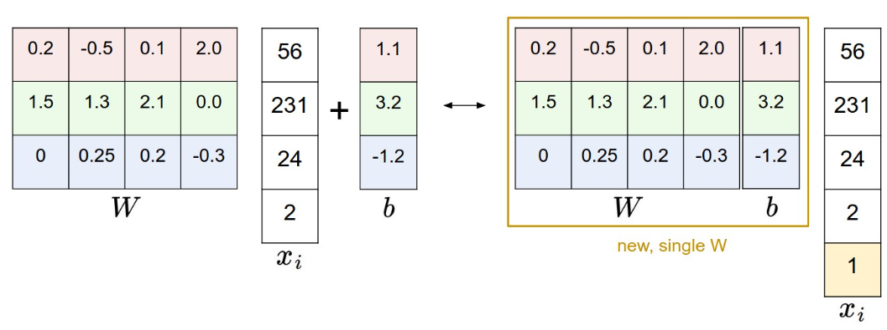

# Assignment 1

> Record some issues encountered during working on assignment 1.

## KNN

+ How to implement a fully vectorized code to calculate the distance matrix between the training set and the test set.

> 定义 `dists[i][j]` 表示第`i` 个测试样本和第 `j` 个训练样本之间的距离(欧几里得距离)。任意两张图片的距离定义为pixel-wise相减平方再求和, 最后开根号.

$$
dist_{a, b} = \sqrt{\sum_{i \in pixel} (a_i - b_i)^2}
$$

```python title="vectorized implementation"
test_square = np.sum(X**2, axis = 1).reshape(num_test, 1)
train_square = np.sum(self.X_train**2, axis = 1).reshape(1, num_train)
inner_product = np.dot(X, self.X_train.T)
dists = np.sqrt(test_square + train_square - 2*inner_product)
```

首先将distance的计算式展开:
$$
dist_{a, b} = \sqrt{\sum_{i \in pixel} a_i^2 + \sum_{i \in pixel} b_i^2 - 2 \sum_{i \in pixel} a_i b_i}
$$

原始矩阵每一行代表一个样本, 按行求平方和即得到了每一张图片像素的平方和, 然后将`test_square`和`train_square`的shape从`(num_test, 1)`和`(1, num_train)`变为`(num_test, num_train)`以便于相加. 这样处理之后这两个数组的每个元素都对应了一张图片的像素平方和.

`test_square + train_square`使用了python的broadcasting机制, 将两个shape分别为`(num_test, 1)`和`(1, num_train)`的矩阵相加, 得到一个shape为`(num_test, num_train)`的矩阵, `Matrix[i][j]`就表示了第`i`个测试样本和第`j`个训练样本的所有像素平方和.

`inner_product = np.dot(X, self.X_train.T)`计算了所有交叉项, `inner_product[i][j]`表示了第`i`个测试样本和第`j`个训练样本pixel-wise的像素乘积之和.

最后将`test_square + train_square - 2*inner_product`的结果开根号即可得到距离矩阵.

## SVM

+ Bias Trick

Recall that we defined the score function as:

$$
f(x_i, W, b) = W \cdot x_i + b
$$

As we proceed through the material it is a little cumbersome to keep track of two sets of parameters (the biases b
and weights W) separately. A commonly used trick is to combine the two sets of parameters into a single matrix that holds both of them by extending the vector xi with one additional dimension that always holds the constant 1 - a default bias dimension. With the extra dimension, the new score function will simplify to a single matrix multiply:

{: width="600px" .center}

+ Image Data Preprocessing

In Machine Learning, it is a very common practice to always perform normalization of your input features (in the case of images, every pixel is thought of as a feature). In particular, it is important to center your data by subtracting the mean from every feature. In the case of images, this corresponds to computing a mean image across the training images and subtracting it from every image to get images where the pixels range from approximately [-127 … 127]. Further common preprocessing is to scale each input feature so that its values range from [-1, 1].

需要将图片像素值归一化到[-1, 1]之间, 即减去像素值的均值再除以像素值的最大值和最小值的差. 这样利于提高数值稳定性与收敛速度.

```python title="Image Data Preprocessing"
# Preprocessing: subtract the mean image
# first: compute the image mean based on the training data
mean_image = np.mean(X_train, axis=0)
print(mean_image[:10]) # print a few of the elements
plt.figure(figsize=(4,4))
plt.imshow(mean_image.reshape((32,32,3)).astype('uint8')) # visualize the mean image
plt.show()

# second: subtract the mean image from train and test data
X_train -= mean_image
X_val -= mean_image
X_test -= mean_image
X_dev -= mean_image

# third: append the bias dimension of ones (i.e. bias trick) so that our SVM
# only has to worry about optimizing a single weight matrix W.
X_train = np.hstack([X_train, np.ones((X_train.shape[0], 1))])
X_val = np.hstack([X_val, np.ones((X_val.shape[0], 1))])
X_test = np.hstack([X_test, np.ones((X_test.shape[0], 1))])
X_dev = np.hstack([X_dev, np.ones((X_dev.shape[0], 1))])

```

+ How to calculate the gradient of SVM loss?

> 我们这里不讨论regularization部分的loss了, 主要难点在与前面的data loss.

Recall the process of calculating the SVM loss:

1. 计算$XW^T$, 得到对每个样本处于各个类别的分数估计.
2. 对于每个训练样本计算$L_i  = \sum_{j \neq y_i} max(0, s_j - s_{y_i} + 1)$.
3. 计算$\frac{1}{N}\sum_i L_i$, 得到总loss.

记N表示样本数量, D表示图片大小(width*height\*channel), C表示类别数量, $X$矩阵中每个图片样本占据一行.

我们首先考虑最终的loss关于$XW^T$的梯度, 其形状应当为N*C.

2, 3两步, 矩阵的形态不会变化, 大小都为N*C, 所以我们对每个元素考虑其梯度.

\[
\begin{bmatrix}
dW^{'}_{11} & dW^{'}_{12} & \cdots & dW^{'}_{1C} \\
dW^{'}_{21} & dW^{'}_{22} & \cdots & dW^{'}_{2C} \\
\vdots & \vdots & \ddots & \vdots \\
dW^{'}_{N1} & dW^{'}_{N2} & \cdots & dW^{'}_{NC}
\end{bmatrix}
\]

首先初始化梯度$dW^{'}$矩阵为全零, 大小为N*C.

第一步计算完毕之后, 每一行对应一张图片在C个类上的分数, 所以一个$L_i$对应着矩阵的一行. 在计算$L_i$时, 对每一项考虑, 如果$s_j - s_{y_i} + 1 > 0$, 则$a_{ij}$处梯度+1, $a_{i, y_i}$处梯度-1, 否则不修改$dW^{'}$矩阵. 最后除以N.

按照上述步骤, 在计算loss的同时, 我们就计算出了loss关于$XW^T$的梯度$dW^{'}$.

下面要计算loss关于W的梯度矩阵(dW应当为W的形状, 即D*C), 只需要求:

$$
dW = X^T \cdot dW^{'}
$$

```python title="SVM Gradient"
def svm_loss_vectorized(W, X, y, reg):
    """
    Structured SVM loss function, vectorized implementation.

    Inputs and outputs are the same as svm_loss_naive.
    """
    loss = 0.0
    dW = np.zeros(W.shape)  # initialize the gradient as zero


    N = len(y)     # number of samples
    Y_hat = X @ W  # raw scores matrix

    y_hat_true = Y_hat[range(N), y][:, np.newaxis]    # scores for true labels
    margins = np.maximum(0, Y_hat - y_hat_true + 1)   # margin for each score
    loss = margins.sum() / N - 1 + reg * np.sum(W**2) # regularized loss

    dW = (margins > 0).astype(int)    # initial gradient with respect to Y_hat
    dW[range(N), y] -= dW.sum(axis=1) # update gradient to include correct labels
    dW = X.T @ dW / N + 2 * reg * W   # gradient with respect to W

    return loss, dW
```

## Softmax

+ Practical issues: Numeric stability

When you’re writing code for computing the Softmax function in practice, the intermediate terms $e^{s_{y_i}}$ and $\sum_j e^{s_j}$ may be very large due to the exponentials. Dividing large numbers can be numerically unstable, so it is important to use a normalization trick. Notice that if we multiply the top and bottom of the fraction by a constant C and push it into the sum, we get the following (mathematically equivalent) expression:

$$
\frac{e^{s_{y_i}}}{\sum_j e^{s_j}} = \frac{Ce^{s_{y_i}}}{C\sum_j e^{s_j}} = \frac{e^{s_{y_i} + \log C}}{\sum_j e^{s_j + \log C}} = \frac{e^{s_{y_i} - s_{max}}}{\sum_j e^{s_j -s_{max}}}
$$

We are free to choose the value of C
. This will not change any of the results, but we can use this value to improve the numerical stability of the computation. A common choice for C is to set $logC=−max_j s_j$. This simply states that we should shift the values inside the vector of scores
so that the highest value is zero.

+ How to calculate the gradient of Softmax loss?

> 同样不讨论regularization部分的loss了.

Recall the process of calculating the Softmax loss:

1. 计算$XW^T$, 得到对每个样本处于各个类别的分数估计.
2. 对于每个训练样本计算$L_i  = -log(\frac{exp(s_{y_i})}{\sum_j exp(s_j)}) = -exp(s_{y_i})+ log(\sum_j exp(s_j))$.
3. 计算$\frac{1}{N}\sum_i L_i$, 得到总loss.

同样, 我们先计算loss关于$XW^T$的梯度, 其形状应当为N*C.

2, 3两步, 矩阵的形态不会变化, 大小都为N*C, 所以我们对每个元素考虑其梯度.

\[
\begin{bmatrix}
dW^{'}_{11} & dW^{'}_{12} & \cdots & dW^{'}_{1C} \\
dW^{'}_{21} & dW^{'}_{22} & \cdots & dW^{'}_{2C} \\
\vdots & \vdots & \ddots & \vdots \\
dW^{'}_{N1} & dW^{'}_{N2} & \cdots & dW^{'}_{NC}
\end{bmatrix}
\]

首先初始化梯度$dW^{'}$矩阵为全零, 大小为N*C.

第一步计算完毕之后, 每一行对应一张图片在C个类上的分数, 所以一个$L_i$对应着矩阵的一行. 在计算$L_i$时, 我们有:

$$
L_i  = -exp(s_{y_i})+ log(\sum_j exp(s_j))
$$

考虑$\frac{\partial L_i}{\partial s_j}$, 如果$j = y_i$, 则:

$$
\frac{\partial L_i}{\partial s_j} = -1 + \frac{exp(s_j)}{\sum_k exp(s_k)}
$$

否则:

$$
\frac{\partial L_i}{\partial s_j} = \frac{exp(s_j)}{\sum_k exp(s_k)}
$$

所以$dW^{'}_{i, y_i}$处梯度应当为$-1 + \frac{exp(s_j)}{\sum_k exp(s_k)}$, 而其他位置梯度为$\frac{exp(s_j)}{\sum_k exp(s_k)}$. 

按照上述步骤, 在求出loss之后我们也顺便求得了loss关于$XW^T$的梯度$dW^{'}$, 不过记得最后要除以N.

下面要计算loss关于W的梯度矩阵(dW应当为W的形状, 即D*C), 只需要求:

$$
dW = X^T \cdot dW^{'}
$$

```python title="Softmax Gradient"
def softmax_loss_vectorized(W, X, y, reg):
    """
    Softmax loss function, vectorized version.

    Inputs and outputs are the same as softmax_loss_naive.
    """
    # Initialize the loss and gradient to zero.
    loss = 0.0
    dW = np.zeros_like(W)

    N = X.shape[0] # number of samples
    Y_hat = X @ W  # raw scores matrix

    P = np.exp(Y_hat - Y_hat.max())      # numerically stable exponents
    P /= P.sum(axis=1, keepdims=True)    # row-wise probabilities (softmax)

    loss = -np.log(P[range(N), y]).sum() # sum cross entropies as loss
    loss = loss / N + reg * np.sum(W**2) # average loss and regularize 

    P[range(N), y] -= 1                  # update P for gradient
    dW = X.T @ P / N + 2 * reg * W       # calculate gradient

    return loss, dW
```

## Two Layer Net

+ Relation among iteration, epoch and batch_size

batch_size指的是一次训练中经过整个网络的数据量, 一个iteration指的就是使用batch_size个数据经过一次前向传播和一次反向传播, 一个epoch指的是使用整个数据集进行一次训练.

所以我们有如下关系:

$$
\text{Iterations Per Epoch} = \frac{\text{Number of Training Samples}}{\text{Batch Size}}
$$

+ Affine Layer

仿射层，通常称为仿射变换层或全连接层（Fully Connected Layer），是神经网络中的一个基本构建块。在数学上，仿射变换是指在向量空间中，输入向量通过线性变换后，再加上一个偏置向量。仿射层的主要作用是将输入向量映射到输出向量空间。

在神经网络中，仿射层的具体计算过程可以表示为：

\[ \mathbf{y} = \mathbf{W} \mathbf{x} + \mathbf{b} \]

## Features

+ We can improve our classification performance by training linear classifiers or two-layer-net not on raw pixels but on features(HOG, histogram, etc) that are computed from the raw pixels.

+ For each image we will compute a Histogram of Oriented Gradients (HOG) as well as a color histogram using the hue channel in HSV color space. We form our final feature vector for each image by concatenating the HOG and color histogram feature vectors.

+ Roughly speaking, HOG should capture the texture of the image while ignoring color information, and the color histogram represents the color of the input image while ignoring texture. As a result, we expect that using both together ought to work better than using either alone. 

!!!success "Feature"
    原来的模型的X矩阵每一行为一张图片的像素值, 而现在我们使用HOG和颜色直方图作为特征, 所以X矩阵每一行就是一张图片的HOG和颜色直方图的特征向量.