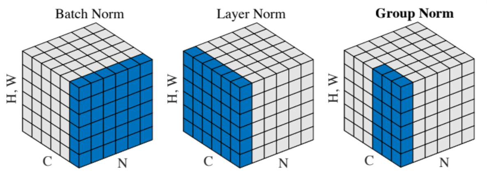

# Assignment 2

> Record some interesting stuff encoutered during assignment 2.

+ After constructing a network, always check whether it can overfit a small amout of data well. If not, may need to consider there's some bugs in code.

+ The weight scale tend to influence deeper network more, since the deeper a network becomes, the easier gradients vanishing/exploding occurs. 当然这是在没有加batch normalization的情况下.

+ 在使用dropout的情况下, 如果我们没有在训练时给输出除以`p`, 会发生什么? `p`定义为保留一个neuron的概率.

    因为在test时我们不考虑dropout, 而是使用所有神经元进行预测, 所以这样的做法会导致在test阶段我们每层得到的输出不是正确的预测结果.

    训练时:

    $$
    E[\hat{y}] = p\hat{y} + (1-p)0 = p\hat{y}
    $$

    测试时:

    $$
    E[\hat{y}] = \hat{y}
    $$

    所以训练时和测试时得到的输出不一致, 这会导致统一数据在训练时得到的loss和test时得到的loss相差一个倍数, 这显然是不合理的. 所以我们早训练时给结果除以p, 用以抵消这一差异.

    $$
    E[\hat y]=\frac{p}{p}\hat y+\frac{(1-p)}{p}0=\hat y
    $$

+ Spatial Batch Normalization

    Normally, batch-normalization accepts inputs of shape `(N, D)` and produces outputs of shape `(N, D)`, where we normalize across the minibatch dimension `N`. For data coming from convolutional layers, batch normalization needs to accept inputs of shape `(N, C, H, W)` and produce outputs of shape `(N, C, H, W)` where the `N` dimension gives the minibatch size and the `(H, W)` dimensions give the spatial size of the feature map.

    If the feature map was produced using convolutions, then we expect every feature channel's statistics e.g. mean, variance to be relatively consistent both between different images, and different locations within the same image -- after all, every feature channel is produced by the same convolutional filter! Therefore, spatial batch normalization computes a mean and variance for each of the `C` feature channels by computing statistics over the minibatch dimension `N` as well the spatial dimensions `H` and `W`.

    简单来讲, 如果当前有`C`层layer, 那么我们对整个batch的每一层layer的所有像素进行一次normalize, 总过进行`C`次.

    ```python
    N, C, H, W = x.shape
    # move the C channel to the last axis, and group the same layer over the entire batch together.
    x = np.moveaxis(x, 1, -1).reshape(-1, C) 
    # use the vinilla batch normalization to deal with the x after reshaping.
    out, cache = batchnorm_forward(x, gamma, beta, bn_param) 
    out = np.moveaxis(out.reshape(N, H, W, C), -1, 1)
    ```

+ Batch Norm, Layer Norm and Group Norm

    {: width="600px", .center}

    可以看到, batch normalization是针对同一像素位置在整个batch上normalize, 而layer normalization是针对同一样本图像自我进行normalize. 这二者都能有效使得每个layer的输入数据zero-centered, 并且分布较为一致. Group normalization则是修改了layer normalization, 不是对整个一个样本进行操作, 而是将一个样本也分为若干组, 在每个组每步normalize.

    在卷积神经网络中, group normalization. 即就是在layer normalization的基础上再把每一层分成G组.

    ```python
    N, C, H, W = x.shape
    ln_param = {"shape":(W, H, C, N), "axis":(0, 1, 3), **gn_param}
    
    # N group for layer normalization, N*G group for spatial group normalization.
    x = x.reshape(N*G, -1)
    gamma = np.tile(gamma, (N, 1, H, W)).reshape(N*G, -1)
    beta = np.tile(beta, (N, 1, H, W)).reshape(N*G, -1)

    # then we just use the vinilla layer normalization.
    out, cache = layernorm_forward(x, gamma, beta, ln_param)
    out = out.reshape(N, C, H, W)
    cache = (G, cache)
    ```

+ Pytorch

    There are loads of stuff, we should consult:

    1. [Pytorch Tutorial](https://github.com/jcjohnson/pytorch-examples).
    2. [API doc](https://pytorch.org/docs/stable/index.html).
    3. [Pytorch Forum](https://discuss.pytorch.org/).

