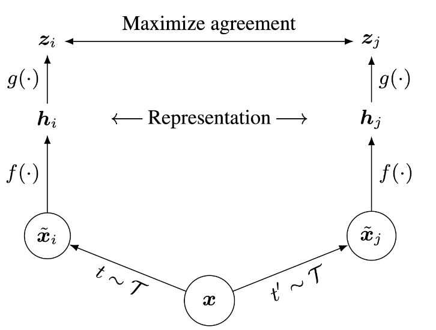

# Assignment 3

## Generative Adversarial Networks (Vinilla GANs)

So far in CS 231N, all the applications of neural networks that we have explored have been **discriminative models** that take an input and are trained to produce a labeled output. This has ranged from straightforward classification of image categories to sentence generation (which was still phrased as a classification problem, our labels were in vocabulary space and we’d learned a recurrence to capture multi-word labels). In this notebook, we will expand our repetoire, and build **generative models** using neural networks. Specifically, we will learn how to build models which generate novel images that resemble a set of training images.

### What is a GAN?

In 2014, [Goodfellow et al.](https://arxiv.org/abs/1406.2661) presented a method for training generative models called Generative Adversarial Networks (GANs for short). In a GAN, we build two different neural networks. Our first network is a traditional classification network, called the **discriminator**. We will train the discriminator to take images and classify them as being real (belonging to the training set) or fake (not present in the training set). Our other network, called the **generator**, will take random noise as input and transform it using a neural network to produce images. The goal of the generator is to fool the discriminator into thinking the images it produced are real.

We can think of this back and forth process of the generator ($G$) trying to fool the discriminator ($D$) and the discriminator trying to correctly classify real vs. fake as a minimax game:

$$
\underset{G}{\text{minimize}}\; \underset{D}{\text{maximize}}\; \mathbb{E}_{x \sim p_\text{data}}\left[\log D(x)\right] + \mathbb{E}_{z \sim p(z)}\left[\log \left(1-D(G(z))\right)\right]
$$

where $z \sim p(z)$ are the random noise samples, $G(z)$ are the generated images using the neural network generator $G$, and $D$ is the output of the discriminator, specifying the probability of an input being real. In [Goodfellow et al.](https://arxiv.org/abs/1406.2661), they analyze this minimax game and show how it relates to minimizing the Jensen-Shannon divergence between the training data distribution and the generated samples from $G$.

To optimize this minimax game, we will aternate between taking gradient *descent* steps on the objective for $G$ and gradient *ascent* steps on the objective for $D$:
1. update the **generator** ($G$) to minimize the probability of the __discriminator making the correct choice__. 
2. update the **discriminator** ($D$) to maximize the probability of the __discriminator making the correct choice__.

While these updates are useful for analysis, they do not perform well in practice. Instead, we will use a different objective when we update the generator: maximize the probability of the **discriminator making the incorrect choice**. This small change helps to allevaiate problems with the generator gradient vanishing when the discriminator is confident. This is the standard update used in most GAN papers and was used in the original paper from [Goodfellow et al.](https://arxiv.org/abs/1406.2661). 

In this assignment, we will alternate the following updates:

+ Update the generator ($G$) to maximize the probability of the discriminator making the incorrect choice on generated data:

$$
\underset{G}{\text{maximize}}\;  \mathbb{E}_{z \sim p(z)}\left[\log D(G(z))\right]
$$

+ Update the discriminator ($D$), to maximize the probability of the discriminator making the correct choice on real and generated data:

$$
\underset{D}{\text{maximize}}\; \mathbb{E}_{x \sim p_\text{data}}\left[\log D(x)\right] + \mathbb{E}_{z \sim p(z)}\left[\log \left(1-D(G(z))\right)\right]
$$

### Discriminator
Our first step is to build a discriminator. Fill in the architecture as part of the `nn.Sequential` constructor in the function below. All fully connected layers should include bias terms. The architecture is:

* Fully connected layer with input size 784 and output size 256
* LeakyReLU with alpha 0.01
* Fully connected layer with input_size 256 and output size 256
* LeakyReLU with alpha 0.01
* Fully connected layer with input size 256 and output size 1
 
Recall that the Leaky ReLU nonlinearity computes $f(x) = \max(\alpha x, x)$ for some fixed constant $\alpha$; for the LeakyReLU nonlinearities in the architecture above we set $\alpha=0.01$.
 
The output of the discriminator should have shape `[batch_size, 1]`, and contain real numbers corresponding to the scores that each of the `batch_size` inputs is a real image.

### Generator
Now to build the generator network:

 * Fully connected layer from noise_dim to 1024
 * `ReLU`
 * Fully connected layer with size 1024 
 * `ReLU`
 * Fully connected layer with size 784
 * `TanH` (to clip the image to be in the range of [-1,1])
 

## Least Squares GAN
We'll now look at [Least Squares GAN](https://arxiv.org/abs/1611.04076), a newer, more stable alernative to the original GAN loss function. For this part, all we have to do is change the loss function and retrain the model. We'll implement equation (9) in the paper, with the generator loss:

$$
\ell_G  =  \frac{1}{2}\mathbb{E}_{z \sim p(z)}\left[\left(D(G(z))-1\right)^2\right]
$$

and the discriminator loss:

$$ 
\ell_D = \frac{1}{2}\mathbb{E}_{x \sim p_\text{data}}\left[\left(D(x)-1\right)^2\right] + \frac{1}{2}\mathbb{E}_{z \sim p(z)}\left[ \left(D(G(z))\right)^2\right]
$$

**HINTS**: Instead of computing the expectation, we will be averaging over elements of the minibatch, so make sure to combine the loss by averaging instead of summing. When plugging in for $D(x)$ and $D(G(z))$ use the direct output from the discriminator (`scores_real` and `scores_fake`).

## Deeply Convolutional GANs
In the first part of the notebook, we implemented an almost direct copy of the original GAN network from Ian Goodfellow. However, this network architecture allows no real spatial reasoning. It is unable to reason about things like "sharp edges" in general because it lacks any convolutional layers. Thus, in this section, we will implement some of the ideas from [DCGAN](https://arxiv.org/abs/1511.06434), where we use convolutional networks 

### Discriminator
We will use a discriminator inspired by the TensorFlow MNIST classification tutorial, which is able to get above 99% accuracy on the MNIST dataset fairly quickly. 

* Reshape into image tensor (Use Unflatten!)
* Conv2D: 32 Filters, 5x5, Stride 1
* Leaky ReLU(alpha=0.01)
* Max Pool 2x2, Stride 2
* Conv2D: 64 Filters, 5x5, Stride 1
* Leaky ReLU(alpha=0.01)
* Max Pool 2x2, Stride 2
* Flatten
* Fully Connected with output size 4 x 4 x 64
* Leaky ReLU(alpha=0.01)
* Fully Connected with output size 1

### Generator
For the generator, we will copy the architecture exactly from the [InfoGAN paper](https://arxiv.org/pdf/1606.03657.pdf). See Appendix C.1 MNIST. See the documentation for [tf.nn.conv2d_transpose](https://www.tensorflow.org/api_docs/python/tf/nn/conv2d_transpose). We are always "training" in GAN mode. 

* Fully connected with output size 1024
* `ReLU`
* BatchNorm
* Fully connected with output size 7 x 7 x 128 
* ReLU
* BatchNorm
* Reshape into Image Tensor of shape 7, 7, 128
* Conv2D^T (Transpose): 64 filters of 4x4, stride 2, 'same' padding (use `padding=1`)
* `ReLU`
* BatchNorm
* Conv2D^T (Transpose): 1 filter of 4x4, stride 2, 'same' padding (use `padding=1`)
* `TanH`
* Should have a 28x28x1 image, reshape back into 784 vector

## Inline Question 6
If the generator loss decreases during training while the discriminator loss stays at a constant high value from the start, is this a good sign? Why or why not? A qualitative answer is sufficient.

### Your answer: 
No, a high loss for the _discriminator_ means it is easy to "fool" it. The _generator_ loss decreases because the classifier "thinks" it generates good samples, however the _discriminator_ is actually unable to classify well and therefore either needs some parameter tuning or network restructuring.

## Self-Supervised Learning 

### What is self-supervised learning?
Modern day machine learning requires lots of labeled data. But often times it's challenging and/or expensive to obtain large amounts of human-labeled data. Is there a way we could ask machines to automatically learn a model which can generate good visual representations without a labeled dataset? Yes, enter self-supervised learning! 

Self-supervised learning (SSL) allows models to automatically learn a "good" representation space using the data in a given dataset without the need for their labels. Specifically, if our dataset were a bunch of images, then self-supervised learning allows a model to learn and generate a "good" representation vector for images. 

The reason SSL methods have seen a surge in popularity is because the learnt model continues to perform well on other datasets as well i.e. new datasets on which the model was not trained on!

### What makes a "good" representation?
A "good" representation vector needs to capture the important features of the image as it relates to the rest of the dataset. This means that images in the dataset representing semantically similar entities should have similar representation vectors, and different  images in the dataset should have different representation vectors. For example, two images of an apple should have similar representation vectors, while an image of an apple and an image of a banana should have different representation vectors.

### Contrastive Learning: SimCLR
Recently, [SimCLR](https://arxiv.org/pdf/2002.05709.pdf) introduces a new architecture which uses **contrastive learning** to learn good visual representations. Contrastive learning aims to learn similar representations for similar images and different representations for different images. As we will see in this notebook, this simple idea allows us to train a surprisingly good model without using any labels.

Specifically, for each image in the dataset, SimCLR generates two differently augmented views of that image, called a **positive pair**. Then, the model is encouraged to generate similar representation vectors for this pair of images. See below for an illustration of the architecture (Figure 2 from the paper).

{: width="400px" .center}

Given an image **x**, SimCLR uses two different data augmentation schemes **t** and **t'** to generate the positive pair of images **$\hat{x}_i$** and **$\hat{x}_j$**. $f$ is a basic encoder net that  extracts representation vectors from the augmented data samples, which yields **$h_i$** and **$h_j$**, respectively. Finally, a small neural network projection head $g$ maps the representation vectors to the space where the contrastive loss is applied. The goal of the contrastive loss is to maximize agreement between the final vectors **$z_i = g(h_i)$** and **$z_j = g(h_j)$**. We will discuss the contrastive loss in more detail later, and you will get to implement it.

After training is completed, we throw away the projection head $g$ and only use $f$ and the representation $h$ to perform downstream tasks, such as classification. You will get a chance to finetune a layer on top of a trained SimCLR model for a classification task and compare its performance with a baseline model (without self-supervised learning).

### SimCLR: Contrastive Loss

A mini-batch of $N$ training images yields a total of $2N$ data-augmented examples. For each positive pair $(i, j)$ of augmented examples, the contrastive loss function aims to maximize the agreement of vectors $z_i$ and $z_j$. Specifically, the loss is the normalized temperature-scaled cross entropy loss and aims to maximize the agreement of $z_i$ and $z_j$ relative to all other augmented examples in the batch:

$$
l \; (i, j) = -\log \frac{\exp (\;\text{sim}(z_i, z_j)\; / \;\tau) }{\sum_{k=1}^{2N} \mathbb{1}_{k \neq i} \exp (\;\text{sim} (z_i, z_k) \;/ \;\tau) }
$$

where $\mathbb{1} \in \{0, 1\}$ is an indicator function that outputs $1$ if $k\neq i$ and $0$ otherwise. $\tau$ is a temperature parameter that determines how fast the exponentials increase.

sim$(z_i, z_j) = \frac{z_i \cdot z_j}{|| z_i || || z_j ||}$ is the (normalized) dot product between vectors $z_i$ and $z_j$. The higher the similarity between $z_i$ and $z_j$, the larger the dot product is, and the larger the numerator becomes. The denominator normalizes the value by summing across $z_i$ and all other augmented examples $k$ in the batch. The range of the normalized value is $(0, 1)$, where a high score close to $1$ corresponds to a high similarity between the positive pair $(i, j)$ and low similarity between $i$ and other augmented examples $k$ in the batch. The negative log then maps the range $(0, 1)$ to the loss values $(\inf, 0)$. 

The total loss is computed across all positive pairs $(i, j)$ in the batch. Let $z = [z_1, z_2, ..., z_{2N}]$ include all the augmented examples in the batch, where $z_{1}...z_{N}$ are outputs of the left branch, and $z_{N+1}...z_{2N}$ are outputs of the right branch. Thus, the positive pairs are $(z_{k}, z_{k + N})$ for $\forall k \in [1, N]$. 

Then, the total loss $L$ is:

$$
L = \frac{1}{2N} \sum_{k=1}^N [ \; l(k, \;k+N) + l(k+N, \;k)\;]
$$

**NOTE:** this equation is slightly different from the one in the paper. We've rearranged the ordering of the positive pairs in the batch, so the indices are different. The rearrangement makes it easier to implement the code in vectorized form.
