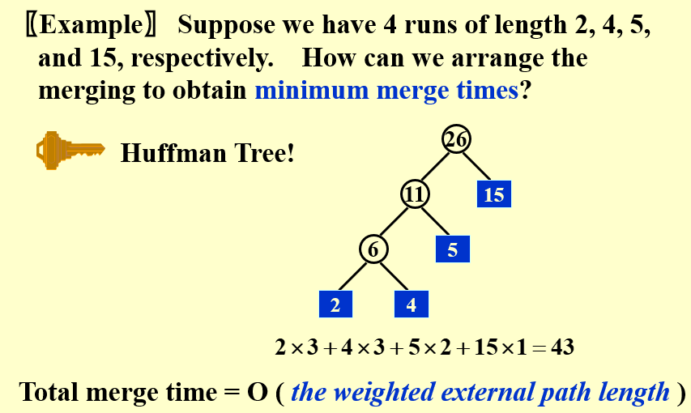

# Welcome to MkDocs

For full documentation visit [mkdocs.org](https://www.mkdocs.org).

## Commands

* `mkdocs new [dir-name]` - Create a new project.
* `mkdocs serve` - Start the live-reloading docs server.
* `mkdocs build` - Build the documentation site.
* `mkdocs -h` - Print help message and exit.

## Project layout

    mkdocs.yml    # The configuration file.
    docs/
        index.md  # The documentation homepage.
        ...       # Other markdown pages, images and other files.

## Codes
```cpp title="trial" linenums="1" hl_lines="1"
#include <bits/stdc++.h>
using namespace std;
```
Let's now try to insert an image.


!!!warning
    This is a warning box.


!!!note
    This is a note box.


!!!question
    This is a question box.

!!!info "You can also change the title"
    hhh

???info "Let's try to collapse a box"
    This is a collapsed box.

???+failure "A collapsed box, but initially expanded"
    This is a collapsed box.

$$
\sum_{i=1}^{\infty} \frac{1}{2^i} = 1
$$
