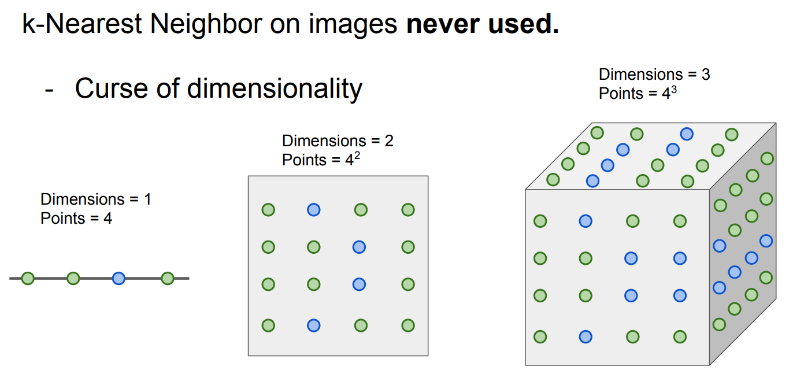

# Lecture 2: Image Classification with Linear Classifiers

> Image Classification is a core task in computer vision.

## The Image Classification Task

> When a computer sees an image, it actually sees a whole bunch of data, a data matrix.

.png){: width="600px", .center}

### Challenges:

+ Viewpoint Variation
+ Illumination
+ Background Clutter
+ Occlusion
+ Deformation
+ Intraclass Variation

These can all make a difference to the data matrix.

### An image classfier

```python
def classify_image(image):
    # some magic here?
    return class_label
```
**Machine Learning**: Data-Driven Approach

1. Collect a dataset of images and labels
2. Use Machine Learning algorithms to train a classifier
3. Evaluate the classifier on new images

```python
def train(images, labels):
    # machine learning
    return model

def predict(model, test_iamges):
    # Use model to predict labels
    return test_labels
```

## Nearest Neighbour Classifier

+ Memorize all the data and labels.
+ Predict the label of the most similar training image.

### Distance Metric to Compare Images

**L1(Manhattan) distance**:

$$
d_1(I_1, I_2) = \sum_p |I^p_1 - I^p_2|
$$

**L2(Euclidean) distance**:

$$
d_2(I_1, I_2) = \sqrt{\sum_p (I^p_1 - I^p_2)^2}
$$

.png){: width="600px" .center}

> 我们可以看到, L1 distance的不变性是在一个菱形的边界上, 而L2 distance的不变性体现在一个圆的边界上. 当我们旋转坐标轴, L1的不变性区域会发生改变, 而L2不会.

### 1-nearest Neighbour Classifier

+ Find the nearest training image to the test image.
+ Use the label of the nearest training image to classify the test image.

```python
class NearestNeighbour:
    def _init_(self):
        pass
    
    def train(self, X, y):
        # Simply memorize the data.
        self.xtr = X
        self.ytr = y

    def predict(self, X):
        num_test = X.shape[0]
        Ypred = np.zeros(num_test, dtype = self.ytr.dtype)

        # loop over all the test images.
        for i in xrange(num_test):
            # We use L1 distance as an example.
            distance = np.sum(np.abs(self.Xtr - X[i, :]), axis = 1)
            min_index = np.argmin(distance)
            Ypred[i] = self.ytr[min_index]

        return Ypred
```

!!!question "With N examples, how fast are tarining and prediction?"
    Training: O(1) <br>
    Prediction: O(N)

This is bad: we want classifiers that are fast at
prediction; slow for training is ok.

> 真实的预测模型需要在使用时有着较高的响应速度, 而训练过程的时间可以相对较长.

.png){: width="400px" .center}

!!!warning 
    如果我们仅仅只考虑最近邻, 那么在实际分类问题中很可能出现下图的情况, 即可能由于某些带有错误或者罕见的数据而导致分类边缘存在锯齿状, 或某一类中出现另外一类的孤岛.

### K-nearest Neighbour Classifier

Instead of copying label from nearest neighbor,
take majority vote from K closest points.

.png){: width="600px" .center}

> 我们可以看到, 适当增大K, 会使得类间边缘变得平滑, 且孤岛面积缩减. 说明一定程度上提升了分类准确性.

不同的distance metric也会导致分类结果有所差异.

!!!info "K-Nearest Neighbors: try it yourself"
    A [website](http://vision.stanford.edu/teaching/cs231n-demos/knn/) to tune K and distance metrices.

### Hyperparameters

> What is the best value of k to use? What is the best distance to use?

These are hyperparameters: choices about the
algorithms themselves.

+ Very problem/dataset-dependent.
+ Must try them all out and see what works best.

To set hyperparameters, we need to divide the dataset into training data, validation data, and test data. 

.png){: width="600px" .center}

Futhermore, we can do the Cross-Validation, which is to split data into folds, and try each fold as validation and average the results. 

.png){: width="600px" .center}

> Cross-Validation is useful for small datasets, but not used too frequently in deep learning.

Example of 5-fold cross-validation
for the value of k(Seems that k ~= 7 works best for this data):

.png){: width="400px" .center}

Choose hyperparameters using the validation set, and only run on the test set once at the very end!

!!!failure "Distance metrics on pixels are not informative Original"
    .png){: width="600px" .center}
    Occluded, shifted or tinted 的图像不一定能够被很好地区分. 而且这些图片就是原图稍作处理的结果, 但是可能与原图有着显著的distance.

!!!failure "Curse of dimensionality"
    {: width="600px" .center}
    使用K近邻算法的话, 我们需要足够多的数据点来cover整个space, 以保证不会出现最近邻都很远的test data. 所以随着dimensionality的增加, 所需的训练数据点的个数会以指数级别增长.

## Linear Classifier

### Definition

.png){: width="600px" .center}

我们使用一个Weight矩阵与输入的图片向量相乘, 加上一个Bias向量, 生成一个$N\times 1$的向量(N为类别数), 每个元素代表图像处于该类的score. Weight矩阵和Bias向量即为linear classifier的Hyperparameter.

Weight矩阵的参数通过Training学习得到, 而Bias向量体现着preference, 即假如待分类的图像中Cat的数量较多, 那么在bias中就可能会将Cat对应的参数人为设置得比其他类都高一些.

### Interpretation

+ Algebraic Viewpoint

Example with an image with 4 pixels and 3 classes.

.png){: width="600px" .center}

+ Visual Viewpoint

.png){: width="600px" .center}

> 我们可以尝试观察一下权重矩阵每一行学习出来的内容到底是什么, 每一行代表一个类别. 可以看到, plane大致就是蓝色的底色(天空)加上了一个形状类似飞机的东西, 而horse类下部有着绿色的背景, 因为马一般和草地一起出现, 但是这匹马似乎有两个头, 这是因为对于每一类我们只能有一行作为分类器, 那么不同姿态的马被平均之后就会产生这种双头的情形.

+ Geometric Viewpoint

.png){: width="600px" .center}

> 在高维空间进行线性规划.

### Hard Cases

.png){: width="600px" .center}

上述这些分类中, 每一个类都很难用直线一条直线划分, 故Linear Classifier在这些分类中表现不好.


