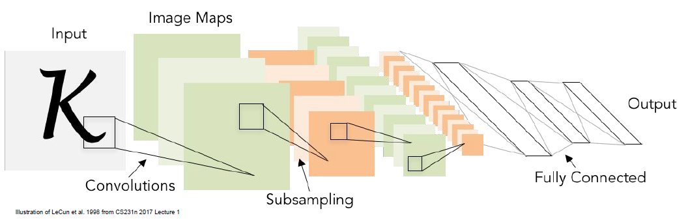

# Lecture 5: Convolutional Neural Networks

## Convolution Layer

### Official Definition

Convolution of two signals:

$$
f[x, y]*g[x, y] = \sum_{n_1 = - \infty}^{\infty}\sum_{n_2 = -\infty}^{\infty}f[n_1, n_2]g[x-n_1, y-n_2]
$$

This is an elementwise multiplication and a sum of a filter and the signal (image).

### Our Usage

Suppose we have a 32*32\*3 image, and a 5\*5\*3 filter, we can perform convolution as following:

.png){: width="600px" .center}

+ Convolve the filter with the image, i.e. "slide over the image spatially, computing dot products". 我们这里的卷积是一个不那么严格的定义, 即$f[x, y]$和$g[x, y]$做卷积时直接采用相同下标即可.
+ Filters always extend the full depth of the input volume. 卷积核和输入图层的深度必须一致.

我们可以使用多个卷积核处理图像, 每个卷积核处理完形成了一个图层, 那么最后输出图层的深度就是卷积核的个数, 如图:

.png){: width="600px" .center}

> 卷积核处理完的结果被称为 activation map(s).

Calculate the size of output volume:
> Suppose our Conv layer accepts a volume of size $W_1 \times H_1 \times D_1$, and the output volume is of the size $W_2 \times H_2 \times D_2$, and we use $K$ filters with size $F \times F \times D_1$.

$$
W_2 = \frac{W_1 - F + 2P}{S} + 1
$$

$$
H_2 = \frac{H_1 - F + 2P}{S} + 1
$$

$$
D_2 = K
$$

+ $P$代表了padding, 为了更好地提取图像边缘/角落信息, 需要在图像周围填充一些像素, 常见的填充方式为 zero padding.

.png){: width="600px" .center}

+ $S$代表了stride, 即卷积核在图像上移动的步长.

!!!example
    .png){: width="600px" .center}
    计算参数个数时不要忘记对于每个卷积核还有一个bias.

!!!note
    .png){: width="600px" .center}

## Fully Connected Layer

每个卷积神经网络中不光有Conv layer, 在最后还会包含一个或者多个FC layer, 比如在image classification问题中, 在卷积层之后的fc layer就用于生成每一类的预测分数. 

.png){: width="600px" .center}

## Pooling Layer

+ makes the representation smaller and more manageable.
+ operates over each activation map independently.

{: width="300px" .center}

最常见的pooling方式是max pooling, 即取每个activation map中每个窗口的最大值, 而且一般这些窗口不相交(stride = window size).

.png){: width="600px" .center}

+ Pooling处理后生成的volume和与原来的volume具有相同的depth.
+ Introduces zero parameters since it computes a fixed function of the input. Pooling layer 不会引入参数.
+ Note taht it is not common to use zero-padding for Pooling layers.

## Convolutional Neural Networks Hierarchy

{: width="600px" .center}

+ ConvNets stack CONV, POOL and FC layers.
+ Tredn towards smaller fliters and deeper architectures.
+ Trend towards getting rid of POOL/FC layers(just CONV).
+ Typical architectures look like:

$$
\text{[(CONV-RELU)*N -> POOL]*M -> (FC-RELU)*K -> softmax}
$$

where N is usually up to ~5, M is large, $0\le K \le 2$.

!!!example
    .png){: width="600px" .center}

## Intuition of Activation Maps

在整个CNN中, 从输入图像到最后的FC layer之间, 会产生一系列的activation maps, 这些activation maps可以看做是CNN对于图像特征的提取. 一般来讲, 较为靠前的activation map提取的是较为简单的low level feature, 而靠后的activation map提取的是较为复杂的high level feature. 如图:

.png){: width="600px" .center}

.png){: width="600px" .center}
> 这张图片使用32个filter对输入图像进行了特征提取, 在activation map中我们是可以看到一些图像的特征的(边缘, 弧度, etc), 并且每个filter提取出的特征都不尽相同.

