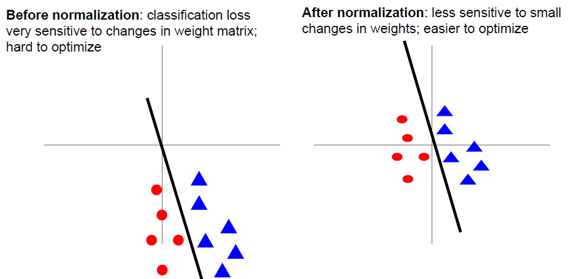
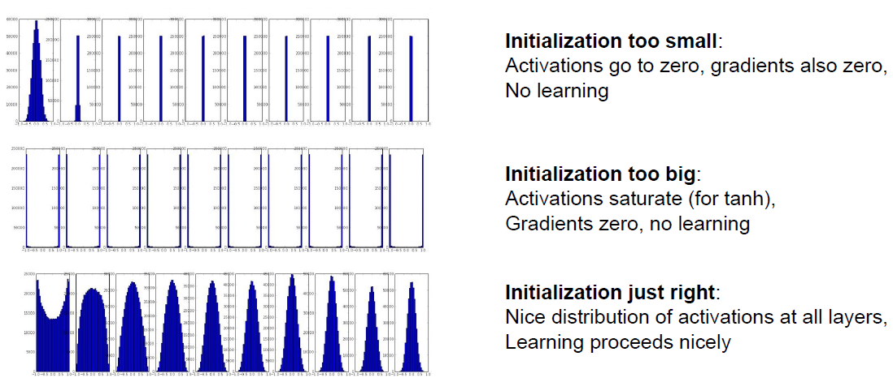

# Lecture 6: Training Neural Networks, Part 1

## Activation Functions

### Sigmoid

.png){: width="200px" .center}

$$
\sigma(x) = \frac{1}{1 + e^{-x}}
$$

+ Squashes numbers to range [0, 1].
+ Historically popular since they have nice interpretation as saturating "firing rate" of a neuron.

> 当神经元接收到足够的刺激时，它的放电率（输出）会趋于一个上限或饱和点，而不会无限增加。

**Three Problems:**

+ Saturated neurons "kill" the gradients.

When x is very positive or very negative, the sigmoid output will be closed to 1 or 0, which means the gradients will be very close to zero.

这样会导致某些参数$w$的梯度一直接近零, 更新速度极其缓慢.

+ Sigmoid outputs are not zero-centered.

这样会导致进入下一layer时的输出全部为正, Consider what happens when the input to a neuron (x) is always positive?

We have:
$$
f(XW + b)
$$

where $f$ is the activation function.

For the gradients respect to W:

$$
\frac{\partial L}{\partial W} = X^T \frac{\partial L}{\partial f}
$$

where $\frac{\partial L}{\partial f}$ is the upstream gradient, which in some cases could be either positive or negative. However, $X^T$ is always positive, which means the gradients respect to $W_{i, j}$ will be all positive or negative. What will this leads to ?

!!!example
    .png){: width="300px" .center}
    可以看到, 假设我们现在只有两个$w$参数, 横轴是$w_1$, 纵轴是$w_2$, 二者的梯度正负形总是相同的, 意味着他们只能$(w_1, w_2)$这一向量只能向着第一三象限进行变化. 但是如果真正的最优$W$处于第四象限, 那么gradient descent的过程必须经历很多zig-zag, 不如直线来得有效率.

由上面这个例子我们可以看出为什么我们希望每个layer的输入数据是zero-centered的.

+ `exp()` is a bit computing expensive.

### Tanh

.png){: width="200px" .center}

$$
\tanh(x) = \frac{e^x - e^{-x}}{e^x + e^{-x}}
$$

+ Squashes numbers to range [-1, 1].
+ Zero-centered(nice).
+ Still kills the gradients when saturated.

### ReLU(Rectified Linear Unit)

.png){: width="200px" .center}

$$
\text{ReLU}(x) = \max(0, x)
$$

+ Does not saturated in positive region.
+ Very computationally efficient.
+ Converges much faster than sigmoid/tanh in practice, about 6 times.
+ Actually more biologically plausible than sigmoid.

!!!Failure
    + Not zero-centered.
    + Can kill the gradients in negative region.

> people like to initialize ReLU neurons with slightly positive biases (e.g. 0.01).

### Leaky ReLU

.png){: width="200px" .center}

$$
\text{Leaky ReLU}(x) = \max(0.01x, x)
$$

+ Does not saturate.
+ Computationally efficient.
+ Converges much faster than sigmoid/tanh in practice, about 6 times.
+ Will not kill the gradients in negative region in comparison with the ReLU.

!!!info "Parametric Rectifier(PReLU)"
    We can also use an activation function of the form:
    $$
    f(x) = max(\alpha x, x)
    $$
    which means using $\alpha$ as a parameter, and let the network learn the best $\alpha$ for each neuron.

### Exponential Linear Unit(ELU)

.png){: width="200px" .center}

$$
\text{ELU}(x) = \begin{cases} x, & x > 0 \\ \alpha(e^x - 1), & x \leq 0 \end{cases}
$$

+ All benefits of ReLU.
+ Closer to zero mean outputs.
+ Negative saturation refime compared to leaky ReLU.
+ Adds some robust to noises.

### Maxout Neural

$$
max(w_1^T x + b_1, w_2^T x + b_2)
$$

+ Does not have the basic form of dot product -> nonlinearity.
+ Generalizes ReLU and Leaky ReLU.
+ Linear Regime! Does not saturate! Does not die!

这样做可以避免掉梯度消失的问题, 选取leaky relu 和 relu中较好的.

但是这样做会导致每个neuron的参数个数加倍.

### Summary

+ Use ReLU. Be careful with your learning rates.
+ Try out Leaky ReLU / Maxout / ELU.
+ Try out tanh, but don't expect much.
+ Don't use sigmoid.

## Data Preprocessing

.png){: width="600px" .center}

``` python title="data_preprocessing"
X -= np.mean(X, axis=0) # 取Column的平均值
X /= np.std(X, axis=0)
```

对于所有training data, 在每个像素位置取平均, 并减去改平均值, 最后除以标准差.

但是CV里面一般都是只减去平均即可, 不需要除以标准差, 因为像素值的范围都是比较统一的.

!!!info "Some intuition about why we need to zero-center and normalize the data"
    {: width="600px" .center}
    可以看到当数据被zero-center之后, 我们稍微扰动一下这条分类的直线, 分类结果(loss)基本不变, 但是当数据没有被zero-center时, 我们稍微扰动一下这条分类的直线, 分类结果(loss)变化较大.

## Weight Initialization

### What happens when $W=0$ initialization is used?

.png){: width="400px" .center}

我们通过这张图来解释, 但是假设有两层hidden layer. Input layer 和 hidden layer之间应当存在一个$W_1$矩阵, 两个hidden layer之间应当存在一个$W_2$矩阵, hidden layer 和 output layer之间应当存在一个$W_3$矩阵. 当$W=0$时, $W_1$和$W_2$都是0矩阵. 假设两个hidden layer的activation function 分别是$f_1$和$f_2$.

$$
X^TW_1 = 0
$$

$$
f_1(X^TW_1) = f_1(0)
$$

$$
f_1(0)W_2 = 0
$$

$$
f_2(f_1(0)W_2) = f_2(0)
$$

$f(0)$代表由激活函数在0处的数值组成的向量, 大小与该layer输出大小一致.

这两个等式说明了在每个hidden layer的输出就是每个元素$f(0)$列向量, 这样在方向传播求$W$梯度时, 会导致在一个$W_i$矩阵内, 每个$W_{i, j}$的梯度都相同, 即这些参数向着相同方向变化, 这显然不是我们需要的训练效果.

### Small Random Numbers

> Therefore, we still want the weights to be very close to zero, but as we have argued above, not identically zero. As a solution, it is common to initialize the weights of the neurons to small numbers and refer to doing so as **symmetry breaking**. 去除权重参数之间的对称性.

The idea is that the neurons are all random and unique in the beginning, so they will compute distinct updates and integrate themselves as diverse parts of the full network. 

We can use `0.01 * np.random.randn(D, H)` to implement this, where `D` is the input dimension, `H` is the hidden layer dimension and `randn` samples from a standard normal distribution.

!!!warning
    It’s not necessarily the case that smaller numbers will work strictly better. For example, a Neural Network layer that has very small weights will during backpropagation compute <u>very small gradients</u> on its data (since this gradient is proportional to the value of the weights). This could greatly <u>diminish the “gradient signal”</u> flowing backward through a network, and could become a concern for deep networks.

### Xavier Initialization

.png){: width="600px" .center}

如图, 上述方法的问题在于, 假设我们初始的数据是满足一定正态分布的, 随着一层一层网络的传播, 均值变化不大, 但是标准差显著下降, 导致靠后的layer接收到的数据不再是近似正态分布的数据.

It turns out that we can normalize the variance of each neuron’s output to 1 by scaling its weight vector by the square root of its fan-in (i.e. its number of inputs). That is, the recommended heuristic is to initialize each neuron’s weight vector as: `W = np.random.randn(n) / sqrt(n), where `n` is the number of inputs of this layer. This ensures that all neurons in the network initially have approximately the same output distribution and empirically improves the rate of convergence.

!!!info 
    Some people recommends an initialization of the form: `W = np.random.randn(n) / sqrt((n_in + n_out) / 2)`, where `n_in` and `n_out` are the number of units in the previous layer and the next layer.

!!!warning 
    When using ReLU, `W = np.random.randn(n) / sqrt(n/2.0)` is a better choice.

!!!info
    A picture to sumarize this.
    {: width="800px" .center}
    直方图显示的是每个layer输入值的分布.

### Bias Initialization

+ It's common to initialize the biases to zero.
+ Some people may initializa the biases to be a small positive value (e.g. 0.01) when the activation function is ReLU, to avoid "dead neurons" (neurons that never activate).

## Batch Normalization

> You want unit gaussian activations? Just make them so.

在每个layer后面加上一步变换, 将该layer的输出转换成标准正态分布.

1. Compute the empirical mean and variance independently for each dimension.

    .png){: width="200px" .center}

    > 注意是将所有训练数据的同一像素位置normalize, 而不是在同一张图片上的所有像素位置normalize.

2. Normalize

    $$
    \hat{x}^{(k)} = \frac{x^{(k)} - E[x^{(k)}]}{\sqrt{Var[x^{(k)}]}}
    $$

    .png){: width="600px" .center}

    !!!question 
        Do we always need the unit input to be gaussian?

3. After normalization, allow the network to squash the range if it wants to:

$$
y^{(k)} = \gamma^{(k)} \hat{x}^{(k)} + \beta^{(k)}
$$

!!!Note
    需要注意的是, 加上这步操作, 相当于实现了不做normaliza和做normaliza的调和, 对于有些layer, 可能normalize就是最好的处理, 那么会学习到$\gamma = 1,\ \beta = 0$, 即一个恒等映射; 对于另一些layer, 可能完全不进行处理的就是最好的, 那么会学习到$\gamma = \sqrt{Var[x^{(k)}]},\ \beta = E[x^{(k)}]$, 即撤销了normalize的操作. 但是对于大多数情况, 应当是处于这二者的中间, 即要进行一定处理, 但也不一定是完全的正态分布, 每个layer的这些参数由训练过程决定.

+ Improve the gradient flow through the network.
+ Allows higher learning rates.
+ Reduces the strong dependence on the initialization.
+ Acts as a form of regularization, reducing the need for dropout, maybe.

解释一下最后一点, 因为每个像素位置都减去了该位置在所有训练数据出的平均值并除以了标准差, 意味着现在这个位置不只考虑了自己的值, 而是一定程度上权衡了各个样本的值, 所以具有一定regularization的效果.

!!!warning
    .png){: width="600px" .center}
    上面这张图片是在training的时候的流程, 但是在test时, 有所区别.

    The mean/std are not computed based on the batch. Instead, a single fixed empirical mean of activations during training is used.(e.g. can be estimated during training with running averages)

## Babysitting the Learning Process

1. Preprocess the data
2. Choose the architecture

      + 比如神经网络整体有多少层, 每层有多少神经元, etc.

3. Double check the loss is reasonable
      + 比如softmax, 初始化之后的loss应当是$1/\text{number of class}$.
      + 然后加上regularization term, loss应当会有所上升.

4. Try to train now

      + Make sure that you can **overfit** very small protion of the training data.
      + Start with small regularization and find learning rate that makes the loss go down.
      + Loss barely changing: Learning rate is
probably too low
      + NaN almost always means high learning rate.
      + Rough range for learning rate we should be cross-validating is somewhere [1e-5, 1e-3].

## Hyperparameter Optimization

First stage: only a few epochs to get rough idea of what params work.

Second stage: longer running time, finer search.

> Tip for detecting explosions in the solver: If the cost is ever > 3 * original cost, break out early.
> It's best to optimize in log space. 意思就是比如想尝试[1e-5, 1e-3]这个范围, 不要使用这个区间内部的线性分布, 而是将每次尝试的值乘一个常数作为下次的尝试值. 可以使用`np.geomspace(begin, end, num)`, 生成一段区间内的等比数列.

!!!info
    有时候貌似找到了很好地的hyper parameter, 从而得到了较高的validation set accuracy, 但其实可能存在潜在的问题.
    .png){: width="600px" .center}
    对于这张图片中的例子, 较好的learning rate都处于我们选定区间的边缘, 这说明我们没有很好地搜索整个空间, 需要在相应边缘处扩大搜索范围.
    
!!!notes "Random Search vs. Grid Search"
    .png){: width="400px" .center}
    当调整的两个hyperparameter时, 如果其中一个较为重要, 另外一个不那么重要, random layout可能会更有优势, 因为在同样取九组参数值的情况下, 对于每个hyperparameter, random layout可以取到更多不同的parameter值, 而grid layout只能取到三个不同值.

It's always a good idea to visulize the loss curve.

.png){: width="600px" .center}

!!!question
    What's happening here?
    .png){: width="400px" .center}
    参数初始化做的不好, 一开始很难找到正确的前进方向来减少loss, 后来某一时刻走上了正确道路, loss开始下降, 回归正轨.

!!!info
    .png){: width="600px" .center}

We can also track the ratio of weight updates/ Weight magnitude. 计算L2 Norm之比.

```python
param_scale = np.linalg.norm(W.raval())
update = -learning_rate*dW
update_scale = np.linalg.norm(update.ravel())
W += update
print(update_scale/param_scale)
```

> We want this ratio to be around 0.001 or so.

## Summary

+ Activation Functions(use ReLU)
+ Data Preprocessing(images: subtract mean)
+ Wieght Initialization(use Xavier init)
+ Batch Normalization(use)
+ Babysitting the Learning Process
+ Hyperparameter Optimization(random sample hyperparameters, in log space when appropriate)