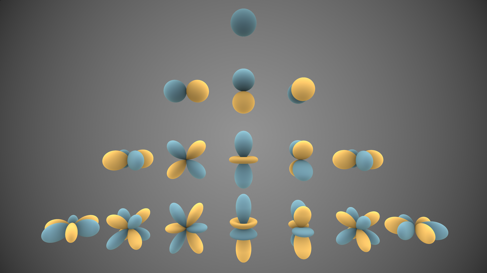

# 3D Gaussian Splatting for Real-Time Radiance Field Rendering

[Paper](https://repo-sam.inria.fr/fungraph/3d-gaussian-splatting/)

## Prliminaries

### 3D Gaussian

Gaussians are defined by a full 3D covariance matrix $\Sigma$ defined in world space centered at point (mean) $\mu$.

$$
p(xa, x2, ..., x_n) = \frac{1}{(2\pi)^{\frac{n}{2}}|\Sigma|^{\frac{1}{2}}}\cdot e^{-\frac{1}{2}(xa-\mu_1)^T\Sigma^{-1}(xa-\mu_1)}
$$

Gaussian 中的协方差矩阵是一个正定矩阵, 一定可以进行对角化, 原文中将其表示为:

$$
\Sigma = RSS^TR^T
$$

其中, $R$是一个旋转矩阵, 通过一个四元数表示, $S$是一个对角矩阵, 由对角线上的三个参数决定, 所以协方差矩阵共有七个参数.

几何上, 3D Gaussian 在空间中对应一个椭球.

### Spherical Harmonics

类比于傅里叶级数, 我们选取一组球面函数作为基函数, 试图拟合一个复杂的表面.

{: width="600px" .center}

当我们允许选取的基函数个数越多, 我们的拟合效果就越好.

.png){: width="600px" .center}

+ 球谐函数用于表达空间中某点的光照模型.
+ 光照函数$C(\theta, \phi)$可以表示为球谐函数的加权线性组合，如下，某一个位置高斯球的函数，输入为角度，输出为这个角度的颜色:

$$
C(\theta, \phi) = \sum_{l=0}^L \sum_{m=-l}^l a_{l}^m Y_{l}^m(\theta, \phi)
$$

其中, $Y_l^m(\theta, \phi)$为球谐函数, $a_l^m$为系数, 参数$l$和$m$分别为阶和次. 阶描述了函数在球面上的波纹数量, 次代表了在一定阶的前提下函数方位角的变化.

+ m由J决定，如J=3, m=-3,-2,-1,0,1,2,3, J =2 m = -2,-1,0,1,2 , 对应7+5+3+1=16个球谐函数，所以有16个系数a,RGB分别对应一个球谐函数线性组合，所以光照模型一共16*3=48个参数，这些参数就是需要优化的变量.

+ 输入$(\theta, \phi)$，确定J,那么球谐函数就是固定的，如下，带入$(\theta, \phi)$，那么球谐函数就是一个个实数.

### Perspective Projection

.png){: width="600px" .center}

我们将世界坐标转换到相机坐标$(x_e, y_e, z_e)$之后, 还需要使用透视投影将相机坐标转换到屏幕坐标$(x_s, y_s, z_s)$.

我们可以得到一个变换矩阵$M_{\text{proj}}$, 作用在$(x_e, y_e, z_e)$上, 得到屏幕坐标. 具体推到详见这篇[博客](https://zhuanlan.zhihu.com/p/181696883).

因为变换后的屏幕坐标是二维的, 所以变换后的坐标$z_s$失去了意义, 但是其实我们可以令$z_s = \sqrt{{x_e^2 + y_e^2 + z_e^2}}$这一关系使得各个点在变换前后沿z轴的遮挡关系不变.

但是加上这一限制之后坐标变换变成了非线性的, 所以我们需要用Taylor展开通过一阶近似来拟合这一非线性变换.

首先将世界坐标转换为相机坐标:

$$
y = p_c = W_w^c p_w + t_w^c
$$

这是一个线性变换, 变换后的结果仍然符合高斯分布:

$$
\Sigma_{p_c} = W\Sigma_{p_w}W^T
$$

接下来从相机坐标变换到像素坐标系, 我们使用一阶泰勒展开近似, 使得结果仍为Gaussian:

$$
z = F(p_c) \approx F(\mu_c) + J(\mu_c)(p_c - \mu_c)
$$

其中$F$为非线性变换, $J$为$F$的雅可比矩阵.

经过这样的两次线性变换, 我们得到了一个在像素坐标系下的二维Gaussian, 同时保留了其距离相机的深度信息. 

$$
\Sigma_z = J\Sigma_{p_c}J^T = JW\Sigma_{p_w}W^TJ^T
$$

$$
\mu_z = F(\mu_c) + J(\mu_c - \mu_c) = F(\mu_c) = F(W_{\mu_{p_w^c}} + t_w^c)
$$

### Splatting and $\alpha$ Blending

Splatting是一种光栅化（Rasterize）3D对象的方法，即将3D对象投影到2D图形。如将3D高斯球（也可以是其他图形）往像素平面扔雪球，在像素平面的能量从中心向外扩散并减弱。

光栅化之后怎么混合这些像素平面的椭球呢？使用α \alphaα blending，主要解决图层融合的问题。
以两幅图像为例，图像$I$的透明度为$\alpha_1$, 图像$I_{bg}$的透明度为$\alpha_2$, 所以二者融合的公式如下:

$$
I_{result} = I \cdot \alpha_1 + I_{bg} \cdot (1-\alpha_2)
$$

现在扩展到多张图, 我们有:

$$
C = \sum_{i=1}^n c_i\alpha_i \prod_{j=1, j\neq i}^n (1-\alpha_j)
$$

## Pipeline

.png){: width="900px" .center}

整个场景的表达依靠很多个Gaussian, 而每个Gaussian都由一系列参数描述, 具体而言, 在这篇论文中有59个参数.

.png){: width="600px" .center}

+ 中心$\mu$: 3.
+ 协方差矩阵$\Sigma$: 7.
+ 球谐函数系数$a$: 48.
+ 透明度$\alpha$: 1.

每一个Gaussian的这些参数也正是我们通过Ground Truth和BackProp进行优化的目标.

### Initialization

首先使用Struct from Motion从图像中估计空间点作为初始场景的描述, 每个点云位置放置一个Gaussian球, 中心点位置设置为点云位置, 其他信息随机初始化.

### Projection

根据相机内外参数矩阵, 把Gaussian球Splatting到图像上. 当一个像素点在Gaussian球的概率为99%的范围内, 认为其被该Gaussian覆盖. 

### Diferentiable Tile Tasterizer

在投影重叠区域进行光栅化渲染（Differentiable Tile Rasterizer），使用α \alphaα blending，这是确定的函数，不需要学习。把这些高斯球进行混合，过程可微.

这部分原文将整张图像分成了很多tile, 然后可以并行处理.

### Optimization

损失函数为:

$$
L = (1-\lambda)L_1 + \lambda L_{D-SSIM}
$$

其中:

+ L1 Loss: 逐个像素比较差异

$$
L_1 = \frac{1}{N}\sum_{i=1}^N |I_i - \hat{I_i}|
$$

+ SSIM loss（结构相似）损失函数：考虑了亮度 (luminance)、对比度 (contrast) 和结构 (structure)指标，这就考虑了人类视觉感知，一般而言，SSIM得到的结果会比L1，L2的结果更有细节，SSIM 的取值范围为 -1 到 1，1 表示两幅图像完全一样，-1 表示两幅图像差异最大.

每次求出Loss之后, 我们使用BackProp求出对于各个Gaussian球参数的梯度, 然后Gradient Descent更新参数.

### Adaptive Density Control

学习过程中，较大梯度（59维导数，模长大）的高斯球存在under-reconstruction和over-reconstruction问题:

.png){: width="600px" .center}

+ under-reconstruction区域的高斯球方差小，进行clone
+ over-reconstruction区域高斯球方差大，进行split
+ 每经过固定次数的迭代进行一次剔除操作，剔除几乎透明（透明度接近0）的高斯球以及方差过大的高斯球
